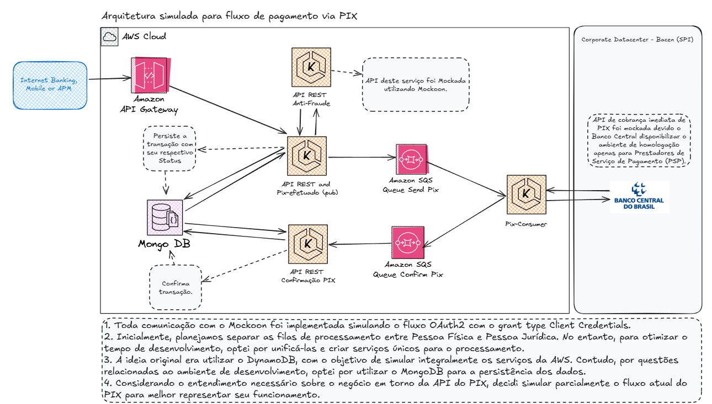

# Desafio Engenharia de Software - Itaú

- Autor: John Enderson
- Release Data: 04/2025
- Linguagem: Java
- Framework: Spring boot
- Status: Em desenvolvimento

## O Desafio

### Requisitos
- Realizar a integração com o Sistema de Pagamentos PIX;
- Criar uma arquitetura que permita a realização do PIX;
- Precisamos armazenar todas as informações que serão comunicadas com o Banco Central;
- Será necessario disponibilizar essa funcionalidade para um Front-end.

### Regras para realização do PIX
1. Realizar uma chamada para a API de Fraudes, onde o retorno poderá ser positivo ou negativo;
2. Comunicar com o banco Central atrávés de MQ (Message Queue)

## 🚀 Tecnologias utilizadas
- Java 21
- Maven
- LocalStack (Para simulação do Amazon SQS)
- Mockoon (Para mock das APIS de Fraude e de PIX)
- MongoDB
- Framework Spring:
  - Spring Boot 3.4.4
  - Spring Cloud OpenFeign
  - Spring Boot Docker Compose (apenas no profile dev)
  - Spring Validation
  - Tomcat (Integrado ao Spring Boot)

## 📌 Arquitetura desenvolvida

Essa arquitetura foi desenvolvida para simular o fluxo de pagamento via PIX utilizando serviços da AWS, com APIs REST, filas SQS e persistência de dados. Para facilitar os testes, alguns componentes foram mockados, como a API anti-fraude e a integração com o Banco Central.

## 🔧 Como executar o projeto

## 💡 Highlights do desafio

Proposta de melhoria

## Referencias
 - [Manual de Padrões para Iniciaçã do Pix](https://www.bcb.gov.br/content/estabilidadefinanceira/pix/Regulamento_Pix/II_ManualdePadroesparaIniciacaodoPix.pdf)
 - [API-DICT](https://www.bcb.gov.br/content/estabilidadefinanceira/pix/API-DICT.html)
 - 